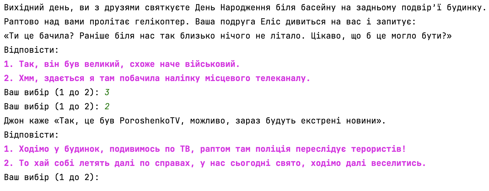

# Interactive Fiction Game

## Topic
Developed an interactive fiction game using design patterns.

## Format
- A plot, characters, ending options.
- Designed the skeleton (framework) of the application.

## Project Requirements
- Designed a class system necessary for the implementation of the program.
- Implemented the program using Java.
- The game allows negative scenarios of events development with a certain probability.
- Used Spring as DI container.

## The game

## License

Unless otherwise stated, the plot within this game is original content created by the author, and is licensed under a [Creative Commons Attribution-NonCommercial 4.0 International License](http://creativecommons.org/licenses/by-nc/4.0/).

You are free to share (copy and redistribute the material in any medium or format) and adapt (remix, transform, and build upon the material) under the following terms:

- Attribution — You must give appropriate credit, provide a link to the license, and indicate if changes were made. You may do so in any reasonable manner, but not in any way that suggests the licensor endorses you or your use.
- NonCommercial — You may not use the material